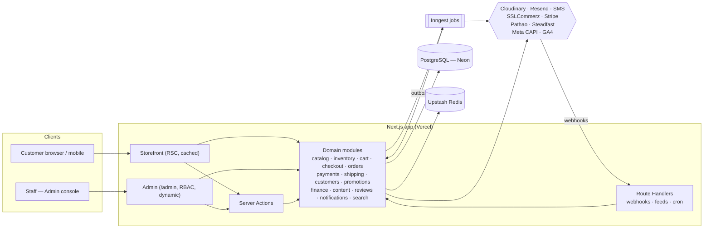

# AUREN — System Architecture

> Status: **Approved baseline v1.0** (2026-10-01). Changes go through [DECISIONS.md](./DECISIONS.md).
> Companion docs: [DATA-MODEL.md](./DATA-MODEL.md) · [../design/DESIGN-SYSTEM.md](../design/DESIGN-SYSTEM.md) · [../../context/feature-list.md](../../context/feature-list.md)

---

## 1. Product vision

AUREN is a premium menswear D2C (direct-to-consumer) commerce platform. It has three jobs, in this order:

1. **Sell.** A fast, editorial, luxury-grade storefront that converts. Every page should feel premium.
2. **Know the real profit.** Track every cost (product landed cost, shipping, gateway fees, packaging, returns, marketing, operating expenses) so you know real profit per order, per product and per month, not just revenue.
3. **Be found.** SEO-first rendering, structured data, product feeds for Google and Meta.

### Success metrics (targets)

| Area | Metric | Target |
|---|---|---|
| Performance | LCP p75 (mobile, 4G) | ≤ 2.0 s |
| Performance | CLS / INP p75 | ≤ 0.05 / ≤ 200 ms |
| Quality | Lighthouse SEO · A11y · Best Practices | ≥ 95 each |
| Quality | Lighthouse Performance (mobile) | ≥ 90 |
| Accessibility | WCAG | 2.2 AA |
| Reliability | Uptime | 99.9 % |
| Checkout | API p95 latency | < 400 ms |
| Business | Checkout conversion (cart → order) | Tracked from day 1 |
| Finance | Order profit visibility | 100 % of orders carry cost snapshot |

---

## 2. Technology stack

| Layer | Choice | Why |
|---|---|---|
| Framework | **Next.js (latest stable, ≥16), App Router, React 19** | RSC + streaming for speed and SEO; Cache Components (`"use cache"`, `cacheTag`) for granular invalidation |
| Language | **TypeScript `strict`** (+ `noUncheckedIndexedAccess`) | End-to-end type safety |
| Database | **PostgreSQL 16+** | Relational integrity for orders/money; FTS + `pg_trgm` for search |
| ORM | **Prisma ORM (latest)** + TypedSQL for reporting queries | Migrations, DX; raw typed SQL for heavy finance aggregates |
| Validation | **Zod** | One schema shared by forms, server actions, route handlers |
| Auth | **Better Auth** (email+password, Google OAuth, phone OTP, admin/RBAC plugin) | Self-hosted, DB-backed sessions, no per-MAU cost |
| Styling | **Tailwind CSS v4** (CSS-first tokens) + **shadcn/ui (Radix)** primitives, restyled to AUREN tokens | Accessible primitives, full visual control |
| Motion | **Motion** (`motion/react`) + CSS View Transitions | Restrained, premium micro-interactions |
| Forms | React Hook Form + Zod resolver | |
| Tables / charts (admin) | TanStack Table · Recharts | |
| Media | **Cloudinary** (behind `MediaProvider` adapter) | On-the-fly AVIF/WebP, art direction, quality fashion imagery |
| Background jobs | **Inngest** (fed by a transactional outbox) | Durable retries on serverless; cron |
| Email | **Resend** + React Email templates | |
| SMS / OTP | Local SMS gateway behind `SmsProvider` adapter | Order confirmation and OTP for the primary market |
| Payments | `PaymentProvider` adapters: **COD**, **SSLCommerz** (cards, bKash, Nagad), **Stripe** (international) | See ADR-007 |
| Shipping | `CourierProvider` adapters: **Pathao**, **Steadfast** (+ manual) | See ADR-008 |
| Rate limiting / cache | **Upstash Redis** | Rate limiting login/OTP/checkout; hot counters |
| Search | Postgres FTS (`tsvector`) + `pg_trgm` → Meilisearch later if needed | No extra infra at launch |
| Hosting | **Vercel** (app) + **Neon Postgres** (Singapore region) | Preview DB branch per PR; nearest region to primary market |
| Observability | **Sentry** (errors + tracing), Vercel Analytics/Speed Insights, structured logs (pino) | |
| Analytics | GA4 + Meta Pixel **and** Meta Conversions API (server-side) | Accurate ad attribution |
| Testing | **Vitest** (unit), **Vitest + Testcontainers** (integration on real Postgres), **Playwright** (E2E + visual), axe-core | |
| Tooling | pnpm, ESLint (flat) + `eslint-plugin-boundaries`, Prettier, Husky + lint-staged, Commitlint (Conventional Commits) | |
| CI/CD | GitHub Actions → Vercel | |

---

## 3. High-level architecture

**Style: a modular monolith.** It is one Next.js deployment with the storefront, admin and API inside it, split into strict domain modules. This gives the speed of a monolith and clean seams to extract services later if ever needed.



### 3.1 Layering rules (enforced by ESLint boundaries)

```
app/ (routes, layouts, pages)          → may import: modules/*/{actions,queries}, components, lib
modules/<x>/actions.ts  (Server Actions) → validate (Zod) → authorize → call service
modules/<x>/queries.ts  (cached reads)   → call service/repository, tag caches
modules/<x>/service.ts  (business rules) → may call own repository + OTHER modules' service public API
modules/<x>/repository.ts (data access)  → only place that touches Prisma for that module
integrations/<provider>                  → only called from services, behind interfaces
```

- **Never** import `prisma` from `app/` or `components/`.
- **Never** reach into another module's repository. Use its service or a domain event.
- Every Server Action and Route Handler validates input with Zod and checks auth/permission **on the server**.
- Client components are leaf nodes (interactivity only). Data fetching happens in Server Components.

### 3.2 Domain events and the transactional outbox

State changes that other modules care about are written as events **in the same DB transaction** (`outbox_events` table). A dispatcher pushes them to Inngest, and handlers run with retries and idempotency.

| Event | Main consumers |
|---|---|
| `order.placed` | inventory (commit/reserve), verification queue (risk scoring, auto-assign), notifications ("order received, we'll confirm shortly"), finance |
| `order.verification_attempted` / `order.on_hold` | verification queue (callback reminders, overdue escalation) |
| `order.confirmed` | fulfillment queue, notifications ("order confirmed"), analytics (CAPI/GA4 Purchase) |
| `order.cancelled` | inventory (release), payments (auto-refund if paid), customers (risk list on `fake_order`), notifications |
| `payment.succeeded` / `payment.failed` | orders, inventory, finance (gateway fee), notifications |
| `shipment.created` / `shipment.status_changed` | orders, notifications, finance (shipping cost) |
| `order.delivered` | finance (revenue recognition), reviews (request-a-review email at +5 days) |
| `return.received` | inventory (restock), payments (refund/store credit), finance |
| `stock.low` / `stock.restocked` | admin alert / back-in-stock notifications |
| `cart.abandoned` | marketing (recovery email/SMS sequence) |
| `purchase_order.received` | inventory (receive stock, recalc weighted average cost) |

### 3.3 Rendering and caching strategy

| Route | Rendering | Cache / invalidation |
|---|---|---|
| Home, collections, PLP, PDP, journal, static pages | Static shell + cached RSC data (`"use cache"`), streamed dynamic islands (price/stock badge, cart count) | `cacheTag('product:<id>')`, `cacheTag('collection:<id>')`, `cacheTag('content:home')`; `revalidateTag` on admin save / stock change |
| Search, filtered PLP | Dynamic RSC, short cache | Query-keyed |
| Cart, checkout, account | Dynamic, no cache, `noindex` | — |
| Admin | Dynamic, auth-gated, `noindex` | — |
| Sitemaps, feeds | Cached, revalidate hourly + on publish | `cacheTag('sitemap')` |

Stock and price shown on PDP come from a small dynamic island, so the page stays static and fast while availability stays accurate.

---

## 4. Repository structure

```
auren-ecommerce/
├─ CLAUDE.md                     # conventions for AI/dev sessions
├─ context/                      # planning + tracking (feature-list, progress)
├─ docs/
│  ├─ architecture/              # ARCHITECTURE, DATA-MODEL, DECISIONS
│  └─ design/                    # DESIGN-SYSTEM, page specs
├─ prisma/
│  ├─ schema.prisma
│  ├─ migrations/
│  ├─ sql/                       # TypedSQL reporting queries
│  └─ seed.ts
├─ public/
├─ src/
│  ├─ app/
│  │  ├─ (storefront)/
│  │  │  ├─ layout.tsx           # header, footer, cart drawer
│  │  │  ├─ page.tsx             # landing (CMS sections)
│  │  │  ├─ shop/[[...category]]/page.tsx
│  │  │  ├─ collections/[slug]/page.tsx
│  │  │  ├─ products/[slug]/page.tsx
│  │  │  ├─ search/page.tsx
│  │  │  ├─ lookbook/[slug]/page.tsx
│  │  │  ├─ journal/(index|[slug])
│  │  │  ├─ pages/[slug]/page.tsx    # about, shipping, returns, legal
│  │  │  ├─ cart/page.tsx
│  │  │  ├─ wishlist/page.tsx
│  │  │  └─ account/...          # orders, addresses, returns, profile
│  │  ├─ (checkout)/checkout/... # distraction-free layout
│  │  ├─ (auth)/login|register|forgot-password|verify
│  │  ├─ admin/                  # RBAC-gated console
│  │  │  ├─ page.tsx             # dashboard
│  │  │  ├─ products/ inventory/ purchasing/ suppliers/
│  │  │  ├─ orders/ shipments/ returns/ customers/
│  │  │  ├─ promotions/ reviews/ content/
│  │  │  ├─ finance/ (expenses, pnl, reports, campaigns)
│  │  │  └─ settings/ (store, staff, shipping, payments, taxes)
│  │  ├─ api/
│  │  │  ├─ auth/[...all]/route.ts
│  │  │  ├─ webhooks/[provider]/route.ts
│  │  │  ├─ inngest/route.ts
│  │  │  └─ feeds/(google|meta)/route.ts
│  │  ├─ sitemap.ts · robots.ts · manifest.ts
│  │  ├─ not-found.tsx · error.tsx · global-error.tsx
│  │  └─ opengraph-image.tsx
│  ├─ modules/
│  │  └─ <module>/  { schemas.ts, types.ts, repository.ts, service.ts,
│  │                  actions.ts, queries.ts, events.ts, __tests__/ }
│  │     modules: catalog, inventory, purchasing, cart, checkout, orders,
│  │              payments, shipping, returns, customers, promotions,
│  │              reviews, content, search, finance, notifications,
│  │              analytics, audit, settings
│  ├─ integrations/
│  │  ├─ payments/{cod,sslcommerz,stripe}/
│  │  ├─ couriers/{pathao,steadfast,manual}/
│  │  ├─ media/cloudinary/ · email/resend/ · sms/<provider>/
│  │  └─ analytics/{meta-capi,ga4}/
│  ├─ components/
│  │  ├─ ui/                     # primitives (Button, Input, Sheet, Dialog…)
│  │  ├─ storefront/             # ProductCard, Gallery, SizeSelector, MegaMenu…
│  │  ├─ admin/                  # DataTable, KpiCard, Charts…
│  │  └─ shared/
│  ├─ lib/
│  │  ├─ db.ts · auth.ts · env.ts (Zod-validated) · money.ts · cache.ts
│  │  ├─ rate-limit.ts · logger.ts · seo/ (metadata, json-ld builders)
│  │  ├─ permissions.ts · idempotency.ts · outbox.ts
│  │  └─ utils/
│  ├─ emails/                    # React Email templates
│  ├─ styles/globals.css         # Tailwind v4 @theme tokens
│  └─ middleware.ts (proxy)      # admin gate, redirects table, geo/currency hint
├─ tests/
│  ├─ e2e/  (Playwright: storefront, checkout, admin, a11y, visual)
│  └─ integration/ (Testcontainers Postgres)
├─ docker-compose.yml            # local Postgres + Mailpit
└─ .github/workflows/ci.yml
```

---

## 5. Domain modules (bounded contexts)

| Module | Responsibility | Key rules |
|---|---|---|
| **catalog** | Products, variants (size × color × fit), options, categories (tree), collections (manual + rule-based), media, size charts, attributes (fabric, occasion, season) | Slug unique and immutable once published (changes create a 301 redirect); variant SKU unique |
| **inventory** | Stock per variant per location, immutable movement ledger, reservations | `available = on_hand − reserved`; never negative; every change writes a `stock_movement` |
| **purchasing** | Suppliers, purchase orders, goods receipts, **landed cost** allocation | Receipt recalculates **weighted average cost** per variant |
| **cart** | Guest + customer carts (cookie token), merge on login | Prices always re-read server-side |
| **checkout** | Address, shipping quote, discounts, totals, order creation | Single transaction: create order + order items (price and cost snapshot) + reserve/commit stock + outbox event; idempotency key per submit |
| **orders** | Order lifecycle, **staff verification queue**, timeline, notes, manual/phone order entry, invoices & packing slips (PDF) | State machine in §6; **every order is staff-verified before fulfillment** (§6.1); human order number `AUR-100001` |
| **payments** | Provider adapters, payment intents, webhooks, refunds, fee capture | Amount verified server-side against order; webhooks idempotent (unique provider event id) |
| **shipping** | Zones & rates (e.g. inside/outside Dhaka), courier booking, tracking sync, COD remittance reconciliation | Records **actual courier cost** per shipment for profit |
| **returns** | Return/exchange requests, inspection, restock, refund or store credit | Exchange-for-size flow is first-class |
| **customers** | Profiles, addresses, wishlist, back-in-stock subscriptions, segments | |
| **promotions** | Coupon codes, automatic discounts, free-shipping thresholds, BXGY, gift cards, store credit | Stacking rules explicit; redemption counted in-transaction |
| **reviews** | Ratings, photo reviews, **fit feedback** (runs small / true / large), moderation | Verified-purchase badge only from delivered orders |
| **content** | Block-based landing pages, banners, navigation, lookbooks (shoppable hotspots), journal, static pages, redirects | Publishing invalidates cache tags |
| **search** | FTS + trigram, facets, suggestions, synonyms | |
| **finance** | Expenses, recurring expenses, marketing campaigns/ad spend, order cost lines, daily summaries, P&L, product profitability | See §7 |
| **notifications** | Email + SMS templates, send log, preferences | All sends async via jobs |
| **analytics** | Server-side events (Meta CAPI, GA4 MP), admin KPIs | Event dedup IDs shared with browser pixel |
| **audit** | Who changed what in admin | Append-only |
| **settings** | Store info, currencies, tax rules, policies, feature flags | |

---

## 6. Order, payment and fulfillment lifecycle

Three independent status fields on `orders`: `status`, `payment_status`, `fulfillment_status`.

```mermaid
stateDiagram-v2
  [*] --> pending_payment: prepaid checkout
  [*] --> placed: COD / manual order
  pending_payment --> placed: payment.succeeded
  pending_payment --> payment_expired: online payment not completed in 15 min → release stock reservation (order never placed; customer can retry or switch to COD)
  placed --> under_verification: staff claims / is assigned
  under_verification --> confirmed: staff verified ✔
  under_verification --> on_hold: unreachable / callback scheduled
  on_hold --> under_verification: next attempt
  under_verification --> cancelled: customer cancelled / fake / out of stock
  on_hold --> cancelled: staff decision only (no auto-cancel)
  placed --> cancelled
  confirmed --> processing: picking
  processing --> shipped: courier booked + handed over
  shipped --> delivered
  shipped --> delivery_failed: RTO (return to origin)
  delivery_failed --> returned_to_origin: restock + record loss
  delivered --> completed: return window passed
  delivered --> return_requested
  return_requested --> returned: received + inspected
  returned --> refunded
  returned --> exchanged
  confirmed --> cancelled
```



**Inventory policy**
- COD/manual: stock is committed on `placed`, so it stays held for the customer while verification happens.
- Prepaid: stock is **reserved** at payment start (TTL 15 min) and committed on `payment.succeeded`. A cron job releases expired reservations.
- Any cancellation during verification releases stock (and refunds a paid order automatically, see below).
- Decrement is atomic: `UPDATE inventory_levels SET reserved = reserved + $q WHERE variant_id=$v AND on_hand - reserved >= $q`. Zero rows updated means out of stock, so overselling is impossible.

### 6.1 Staff order verification (mandatory for every order)

**Rule: no order reaches fulfillment until an authorized staff member has verified and confirmed it.** This applies to every payment method (COD and prepaid) and every channel (web, manual, social). Nothing is auto-confirmed.

**Who can verify:** staff whose role has the `orders.verify` permission. Default roles with it: `owner`, `admin`, `manager`, `support`. The owner can grant it to any role, or to a dedicated `order_verifier` role.

**Verification queue** (`/admin/orders/verification`):
- Lists every `placed` / `under_verification` / `on_hold` order, oldest first, with an age timer, risk score and flags (new customer, high value, repeat-RTO phone, mismatched name/area, duplicate order in last 24 h).
- **Claim or assign:** a staff member claims an order (`assigned_to`), which locks it for others for 15 minutes (auto-unlock if idle). Managers can assign or reassign, and round-robin auto-assignment is optional.
- **Verification checklist** (each item must be ticked to confirm): customer reachable and order genuine · items, size and colour confirmed · delivery address complete and serviceable · payment checked (prepaid: amount received; COD: customer agrees to pay amount) · stock physically available.
- **Contact tools:** click-to-call, SMS and WhatsApp templates ("Hi {name}, this is AUREN confirming your order {no}…"), with every attempt logged.
- **Outcomes:**
  - **Confirm:** `confirmed`, records `confirmed_by` and `confirmed_at`, sends "Order confirmed" email/SMS and moves the order to the fulfillment queue.
  - **Unreachable / call back later:** `on_hold` with `next_attempt_at`; the attempt counter goes up.
  - **Edit and confirm:** staff can change size/colour/quantity, add or remove items, or fix the address at the customer's request. Totals are recalculated server-side, stock is adjusted, the change is written to the audit log and order timeline, and a changed total triggers an updated confirmation message to the customer.
  - **Cancel** with a required reason (`customer_cancelled`, `fake_order`, `unreachable`, `out_of_stock`, `duplicate`, `address_unserviceable`, `other`). Stock is released, a paid order gets a refund created automatically, and `fake_order` adds the phone to the risk list.
- **No auto-cancel (owner decision, 2026-10-01):** the system never cancels an order on its own. Only staff can cancel, with a reason. Orders that stay unreachable or unverified keep showing in the queue as **overdue** and escalate to managers. Auto-cancel can be added later as an opt-in setting if the owner asks (new ADR required).
- **SLA:** target time from placed to verified (default 2 working hours). Overdue orders are highlighted, an alert goes to managers, and orders with many failed attempts (default 3) get a "needs manager review" flag. Flagging never cancels the order.
- **Manual orders** created by staff go through the same queue. A setting (`manual_orders_self_verify`, default **off**) controls whether the creator can confirm their own manual order.
- **Business hours:** the confirmation message tells customers when to expect the call (for example "We'll call you within 2 hours, 10 am – 9 pm").

**Customer experience:** the confirmation page, order emails and account timeline show **Placed → Verified → Shipped → Delivered**, with copy that makes verification feel like a concierge touch ("Our team will personally confirm your order shortly.").

**Analytics:** the server-side Purchase event (Meta CAPI / GA4) is sent at **confirmation**, not at placement, so ad platforms optimize for real, verified orders. A browser `OrderPlaced` custom event is still fired at checkout.

**Metrics:** verification rate, cancellation rate by reason, median time-to-verify, attempts per order, and per-staff performance (verified, cancelled, SLA %).

**COD risk controls (primary market)**: verification as above, plus a per-phone order-velocity limit, a blocklist of repeat-RTO / fake-order phones, and an optional advance delivery charge for high-risk orders.

---

## 7. Finance and cost-tracking design

The second core goal. **Principle: every taka spent or earned is attached to a source record, and profit is derived from those records rather than typed in by hand.**

### 7.1 Cost sources

| Cost | Where captured | When |
|---|---|---|
| Product cost (COGS) | `purchase_order_items.unit_cost` + allocated landed costs (freight, duty, customs, inbound transport) → `product_variants.avg_cost_minor` | On goods receipt |
| COGS per sale | `order_items.unit_cost_minor` (**snapshot** of avg cost at order time) | On order placed |
| Outbound shipping cost | `shipments.cost_minor` (from courier API/invoice) → `order_cost_lines` | On shipment booked / reconciled |
| Payment gateway fee | `payments.fee_minor` → `order_cost_lines` | On payment success / settlement |
| COD collection charge | courier COD fee → `order_cost_lines` | On COD remittance reconciliation |
| Packaging | per-order packaging template cost (box, tissue, card) → `order_cost_lines` | On fulfillment |
| Returns / RTO | return shipping, damaged write-off → `order_cost_lines` / `stock_movements(type=write_off)` | On return/RTO processed |
| Discounts | `order_items.discount_minor`, `orders.discount_minor` | On order placed |
| Marketing / ad spend | `expenses` linked to `marketing_campaigns` (channel: Meta, Google, influencer…) | Manual entry or CSV import |
| Operating expenses | `expenses` (rent, salaries, photography, software, utilities, misc) incl. **recurring** templates and receipt attachments | Manual / auto-generated monthly |

### 7.2 Formulas (implemented in `modules/finance/service.ts`, unit-tested)

```
Gross sales           = Σ order_items.unit_price × qty
Net sales             = Gross sales − discounts − refunds
COGS                  = Σ order_items.unit_cost_snapshot × qty  (− restocked returns)
Gross profit          = Net sales − COGS
Contribution margin   = Gross profit + shipping charged − shipping cost − gateway fees
                        − COD fees − packaging − return/RTO costs
Net profit            = Contribution margin − operating expenses − marketing spend
ROAS (campaign)       = attributed net sales / campaign spend
CAC                   = marketing spend / new customers
Weighted avg cost     = (on_hand × old_avg + received_qty × landed_unit_cost) / (on_hand + received_qty)
```

**Revenue recognition** defaults to **delivered date**, because COD money is not real until delivered. Reports can toggle to "placed date" to see pipeline.

### 7.3 Reports (admin → Finance)
P&L by day/week/month/custom; profit per order (list + detail breakdown); product & variant profitability (units, revenue, margin %, return rate); category/collection margin; campaign ROAS & CAC; inventory valuation (on hand × avg cost) and dead-stock aging; expense breakdown by category; COD remittance reconciliation (expected vs received from courier); cash-flow view. All exportable to CSV, and P&L to PDF.

`daily_financial_summaries` is a rollup table, recomputed for a date when an event touches that date, so dashboards stay instant.

---

## 8. Money, tax, currency

- Money is stored as **`BIGINT` minor units** (poisha/cents) + `currency CHAR(3)`. Floats are never used. `lib/money.ts` handles arithmetic, rounding (banker's for tax), allocation of discounts across lines (largest remainder) and formatting via `Intl.NumberFormat`.
- Base currency: **BDT** (configurable). Multi-currency display is a later phase, and settlement stays in the base currency.
- Tax: configurable rules (inclusive or exclusive, rate per category). Default is **prices tax-inclusive**, with the VAT portion shown on the invoice.

---

## 9. SEO architecture

- **Server-rendered HTML** for all indexable pages, with `generateMetadata` per route.
- **URLs**: `/products/{slug}`, `/collections/{slug}`, `/shop/{category}/{sub}`, `/journal/{slug}`, `/lookbook/{slug}`. Lowercase, hyphenated, no IDs. Slug changes auto-insert a `redirects` row (301).
- **Canonical** on every page. Faceted filters use query params; only whitelisted facet pages (e.g. `/shop/shirts?color=white`) get a self-canonical, and everything else canonicalizes to the base category with `noindex,follow` on deep filter combos.
- **Pagination**: crawlable `?page=N` links behind the "Load more" UI.
- **Structured data (JSON-LD)**: `Organization`, `WebSite` + `SearchAction`, `BreadcrumbList`, `Product` with `Offer`/`AggregateOffer`, `AggregateRating`, `Review`, `MerchantReturnPolicy`, `OfferShippingDetails`, `CollectionPage`/`ItemList`, `Article` for journal, `FAQPage` where relevant.
- **Sitemaps**: `sitemap.ts` index split into products, collections/categories, content, and image sitemap entries. `robots.ts` disallows `/admin`, `/account`, `/checkout`, `/cart`, `/api`.
- **Open Graph / Twitter** images generated with `next/og` per product and collection.
- **Feeds**: Google Merchant Center + Meta Catalog product feeds (`/api/feeds/google`, `/api/feeds/meta`).
- **Content SEO**: editable SEO title/description per product, collection and page; journal for long-tail content ("how to style an oxford shirt"); descriptive image alt text required on upload.
- **Core Web Vitals** treated as SEO: see §10.
- **i18n-ready**: English at launch with no locale prefix. If Bangla is added, it goes under `/bn/...` with `hreflang`, so existing URLs never change.

---

## 10. Performance budget

| Budget | Limit |
|---|---|
| JS on PDP (first load, gzipped) | ≤ 130 KB |
| LCP image | AVIF/WebP, `priority`, correct `sizes`, served ≤ 200 KB on mobile |
| Fonts | 2 families max, self-hosted via `next/font`, `display: swap`, subset |
| Third-party scripts | Loaded after interaction/idle (`next/script` `lazyOnload`); pixels deduped with server CAPI |
| Images | Explicit width/height (zero CLS), dominant-color/blur placeholder stored at upload |

CI runs Lighthouse CI on Home, PLP, PDP and Checkout, and fails the build if a budget is broken.

---

## 11. Security

| Concern | Control |
|---|---|
| AuthN | Better Auth DB sessions, httpOnly + Secure + SameSite=Lax cookies; argon2/scrypt hashing; email verification; optional 2FA (TOTP) **required for staff** |
| AuthZ | RBAC roles: `owner`, `admin`, `manager`, `order_verifier`, `fulfillment`, `finance`, `content_editor`, `support`; permission checks in every admin action via `assertPermission()` |
| Input | Zod on every action/handler; Prisma parameterization; markdown/HTML sanitized (rehype-sanitize) |
| CSRF | Server Actions origin check + SameSite cookies; webhooks verify provider signatures/IPN validation |
| Abuse | Upstash rate limits on login, OTP, register, checkout submit, coupon apply, review submit |
| Payments | Never trust client totals; server recomputes. Verify payment with provider API (not only redirect params). Idempotency keys. No card data touches our servers (hosted pages), so PCI scope is SAQ-A |
| Headers | CSP as a static header without nonces (ADR-016: nonces are incompatible with the prerendered shell), HSTS, X-Content-Type-Options, X-Frame-Options, Referrer-Policy, Permissions-Policy, COOP, frame-ancestors none |
| Secrets | Zod-validated `env.ts`; Vercel encrypted env; no secrets in client bundles (`server-only`) |
| Data | Least PII; addresses/phones only where needed; audit log for staff actions; GDPR-style export/delete for customers |
| Supply chain | Dependabot/Renovate, `pnpm audit` in CI, lockfile enforced |
| Backups | Neon PITR (point-in-time restore) + nightly logical dump to object storage; restore drill before launch |

---

## 12. Environments and delivery

| Env | Purpose | DB |
|---|---|---|
| Local | `docker compose up` (Postgres + Mailpit), seed data with realistic menswear catalog | local container |
| Preview | Every PR → Vercel preview | Neon branch per PR |
| Staging | `main` auto-deploy; sandbox payment/courier keys | Neon staging |
| Production | Tagged release / promote | Neon prod (PITR) |

**CI pipeline (every PR)**: install → typecheck → lint → unit tests → integration tests (Testcontainers) → build → Playwright E2E on preview → Lighthouse CI → axe accessibility. Merge needs green CI + review.

**Git**: trunk-based, short-lived branches `feat/<area>-<desc>`, Conventional Commits, squash merge, changelog generated from commits.

**Definition of Done (each sub-feature)**: types + lint clean · unit/integration tests for business rules · E2E for user-visible flows · a11y check passes · loading/empty/error states designed · SEO metadata (if public) · permission check (if admin) · audit log (if admin mutation) · docs/progress updated · code review passed.

---

## 13. Observability and operations

- Sentry for errors + performance traces (source maps uploaded in CI); alerts on checkout/payment error spikes.
- Structured JSON logs with `requestId`, `orderId`, `userId` correlation.
- Admin "System health" page: failed jobs, webhook failures, outbox backlog, low-stock count.
- Uptime monitor on `/`, `/api/health` (DB + Redis ping).
- Runbooks in `docs/runbooks/` (payment webhook failure, courier API down, restore DB). Written in the launch module.

---

## 14. Scalability path (when it is needed, not before)

1. Move search to Meilisearch/Typesense once the catalog passes ~5k SKUs or richer relevance is needed.
2. Add Postgres read replica for admin reporting.
3. Partition `stock_movements` / `audit_logs` / `outbox_events` by month.
4. Extract `finance` reporting into a separate worker if rollups get heavy.
5. Headless mobile app can reuse module services via a typed API layer (route handlers / tRPC).
