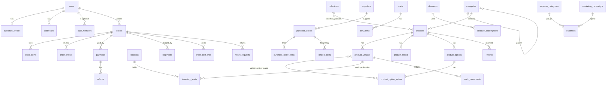

# AUREN — Data Model (PostgreSQL)

> Logical model. The physical source of truth will be `prisma/schema.prisma` + migrations. When they diverge, update this doc in the same PR.

## Conventions

- Primary keys: `id UUID` (UUIDv7, time-ordered, generated by Prisma `uuid(7)`; `lib/ids.ts newId()` for raw SQL and fixtures) unless noted. Human-facing numbers (order, PO, return) have their own sequence columns.
- Every table has `created_at timestamptz default now()`, `updated_at timestamptz`. Soft delete (`deleted_at`) only where noted (catalog, customers).
- Money: `*_minor BIGINT NOT NULL` + `currency CHAR(3)` on the owning record. Never floats.
- Enums: Postgres enums via Prisma for fixed state machines; `text` + check constraint for extensible lists.
- Snapshots: orders copy product title, SKU, options, price and cost at purchase time, so later catalog edits never rewrite history.
- Ledger tables (`stock_movements`, `audit_logs`, `store_credit_ledger`, `outbox_events`) are **append-only**.
- Naming: `snake_case` tables/columns (Prisma `@@map`/`@map`), plural table names.

## ER overview

---

## 1. Identity and access

| Table | Key columns | Notes |
|---|---|---|
| `users` | email (unique, citext), phone (unique, E.164), name, email_verified, phone_verified, image, banned, two_factor_enabled, must_change_password | Better Auth core. There is no `role` column: a user is staff if and only if an active `staff_members` row exists (ADR-017). Credential accounts use `accounts.account_id = users.id`. `must_change_password` is set for the first owner (bootstrap password) and cleared when the password is changed; staff with it set are held at `/admin/security` |
| `sessions`, `accounts`, `verifications`, `two_factors` | Better Auth managed | OAuth, email verification, TOTP secrets and backup codes |
| `staff_members` | user_id (unique), role (`owner`,`admin`,`manager`,`order_verifier`,`fulfillment`,`finance`,`content_editor`,`support`), active, invited_by | 2FA state lives on `users.two_factor_enabled` (single source of truth) |
| `role_permissions` | role, permission (e.g. `orders.verify`, `orders.update`, `finance.read`), created_at | PK(role, permission). Default grants are inserted by migration `add_staff_access` and guarded by a drift test against `lib/permissions.ts` (also for later migrations that add permissions); read-only for the application role (ADR-021), changed only by migrations; every insert, update or delete writes an `audit_logs` row through a trigger (`role_permissions_audit_trg`, ADR-023); the owner role always holds every permission in code |
| `customer_profiles` | user_id, birthday, preferred_size_top/bottom, marketing_opt_in_email/sms, total_spent_minor, orders_count, first_order_at, segment, notes, deleted_at | Denormalized stats updated by events |
| `addresses` | user_id, label, full_name, phone, line1, line2, area, city/thana, district, division, postal_code, country (ISO-2), is_default | BD address hierarchy (division → district → thana/area) |
| `geo_areas` | id, parent_id, level (`division`,`district`,`thana`,`area`), name, name_bn, courier_codes (jsonb) | Drives address pickers + courier zone mapping |

## 2. Catalog

| Table | Key columns | Notes |
|---|---|---|
| `categories` | parent_id, slug (unique per parent), name, description, image, image_alt (required with an image), position, path (materialized, e.g. `tops/shirts`), seo_title, seo_description, is_active | Tree |
| `products` | slug (unique), title, subtitle, description (markdown), status (`draft`,`active`,`archived`), category_id, product_type (shirt, trouser, blazer…), material, care_instructions, fit (`slim`,`regular`,`relaxed`), origin, tags text[], attributes jsonb (fabric, occasion, season, pattern), size_chart_id, seo_title, seo_description, published_at, featured_rank, search_vector tsvector (generated), deleted_at | GIN on `search_vector`, trigram on `title` |
| `product_options` | product_id, name (`Size`,`Color`,`Fit`), position | |
| `product_option_values` | option_id, value, label, swatch_hex, swatch_image, position | |
| `product_variants` | product_id, sku (unique), barcode, price_minor, compare_at_minor, avg_cost_minor, currency, weight_g, status, position, is_default | Price lives on the variant |
| `variant_option_values` | variant_id, option_value_id | PK (variant_id, option_value_id) |
| `product_media` | product_id, option_value_id (nullable, ties images to a color), type (`image`,`video`), provider (`static`,`local`,`vercel-blob`), storage_key (random, never a client filename), url, content_type (jpeg/png/webp/avif, never SVG), size_bytes, alt (required), width, height, dominant_color, blur_data, position | Uploads re-encoded and metadata-stripped by `lib/media` (ADR-026); CHECKs: uploads need key, type and size; `static` rows are development placeholders |
| `size_charts` | name, unit (`cm`,`in`), table jsonb (`{ columns: string[], rows: [{ size, values: string[] }] }`), how_to_measure (markdown), model_info | Products point at one via `products.size_chart_id` (SET NULL on delete) |
| `collections` | slug, title, description, hero_media, type (`manual`,`automatic`), rules jsonb (e.g. tag in, price <, category =), sort_order (`manual`,`best_selling`,`newest`,`price_asc`…), seo_*, published_at, is_featured | |
| `collection_products` | collection_id, product_id, position | Manual members, or the materialised result of an automatic collection (rewritten synchronously on product writes, ADR-028) |
| `product_relations` | product_id, related_product_id, type (`complete_the_look`,`similar`,`upsell`), position | Curated cross-sell |
| `redirects` | from_path (unique), to_path, status_code (301/302), hits | Auto-created on slug change of a live product, category or collection; chains stay one hop (ADR-028) |

## 3. Inventory and purchasing

| Table | Key columns | Notes |
|---|---|---|
| `locations` | name, type (`warehouse`,`store`), address jsonb, is_default, is_active | Start with one warehouse; a partial unique index allows exactly one default |
| `inventory_levels` | variant_id, location_id, on_hand INT ≥ 0, reserved INT ≥ 0, low_stock_threshold | PK(variant_id, location_id); CHECK `reserved <= on_hand`; rows are created on first receipt or adjustment, so a new variant has no row (zero stock). Only `inventoryService` writes here |
| `stock_movements` | variant_id, location_id, type (`receipt`,`sale`,`reservation`,`release`,`return_restock`,`adjustment`,`transfer_in`,`transfer_out`,`write_off`), quantity (signed), unit_cost_minor, reference_type, reference_id, reason, actor_id | Append-only ledger (trigger enforced, UPDATE and DELETE revoked from the app role). `reservation`/`release` explain `reserved`; all other types explain `on_hand` (ADR-029) |
| `stock_reservations` | variant_id, location_id, quantity > 0, reference_type, reference_id, status (`active`,`committed`,`released`), expires_at (default 15 min), resolved_at | UNIQUE(reference_type, reference_id, variant_id) makes reserve idempotent; `release_expired_reservations()` frees expired ones |
| `suppliers` | name, contact_name, phone, email, address, payment_terms, notes, is_active | |
| `purchase_orders` | po_number (sequence, `PO-0001`), supplier_id, status (`draft`,`ordered`,`partially_received`,`received`,`cancelled`), ordered_at, expected_at, currency (base currency only for now), notes, created_by | Lines editable only in draft |
| `purchase_order_items` | po_id, variant_id, quantity_ordered, quantity_received, unit_cost_minor | |
| `landed_costs` | po_id, type (`freight`,`customs_duty`,`inbound_transport`,`agent_fee`,`other`), amount_minor, allocation_method (`by_quantity`,`by_value`) | Allocated into variant landed unit cost on receipt |
| `goods_receipts` | po_id, received_at, received_by, location_id, notes | Append-only. One delivery |
| `goods_receipt_items` | receipt_id, po_item_id, quantity, unit_cost_minor, landed_cost_minor | Append-only. Each line writes a `stock_movements(type=receipt)` row and recalculates `product_variants.avg_cost_minor` (ADR-029) |

## 4. Cart and checkout

| Table | Key columns | Notes |
|---|---|---|
| `carts` | token (unique, cookie), user_id (nullable), currency, discount_code, expires_at, abandoned_notified_at, utm jsonb | Merged on login |
| `cart_items` | cart_id, variant_id, quantity, added_at | UNIQUE(cart_id, variant_id) |
| `checkouts` | cart_id, email, phone, shipping_address jsonb, shipping_rate_id, payment_method, idempotency_key (unique), totals jsonb, status, expires_at | Transient; converts to order |

## 5. Orders, payments, shipping, returns

| Table | Key columns | Notes |
|---|---|---|
| `orders` | order_number (seq, `AUR-100001`), user_id (nullable for guest), email, phone, status, payment_status (`unpaid`,`pending`,`paid`,`partially_refunded`,`refunded`,`failed`), fulfillment_status (`unfulfilled`,`partially_fulfilled`,`fulfilled`,`returned`), channel (`web`,`manual`,`facebook`,`instagram`,`whatsapp`,`store`), currency, subtotal_minor, discount_minor, shipping_charged_minor, tax_minor, total_minor, paid_minor, refunded_minor, shipping_address jsonb, billing_address jsonb, discount_codes text[], customer_note, risk_score, risk_flags text[], utm jsonb, placed_at, **assigned_to** (staff), **assigned_at**, **verification_attempts** INT, **next_attempt_at**, **confirmed_by** (staff), confirmed_at, delivered_at, cancelled_at, **cancelled_by**, cancel_reason (`customer_cancelled`,`fake_order`,`unreachable`,`out_of_stock`,`duplicate`,`address_unserviceable`,`payment_failed`,`other`), cancel_note | status adds `under_verification`, `on_hold`, `payment_expired` (abandoned online payment, never placed). The system never sets `cancelled`; only staff do. Indexes: (status, placed_at), (assigned_to, status), (next_attempt_at) partial for `on_hold`, (user_id), (phone), (delivered_at) |
| `order_items` | order_id, variant_id, product_id, title_snapshot, variant_title_snapshot (e.g. "White / M / Slim"), sku_snapshot, image_snapshot, unit_price_minor, compare_at_minor, unit_cost_minor (**COGS snapshot**), quantity, discount_minor, tax_minor, total_minor, quantity_returned | |
| `order_events` | order_id, type (`status_changed`,`note`,`payment`,`shipment`,`email_sent`,`sms_sent`,`assigned`,`verification_attempt`,`order_edited`,`confirmed`,`cancelled`…), from_status, to_status, payload jsonb, actor_id | Timeline (customer-visible subset) |
| `order_verification_attempts` | order_id, staff_id, channel (`call`,`sms`,`whatsapp`,`messenger`), outcome (`verified`,`no_answer`,`busy`,`wrong_number`,`callback_requested`,`customer_cancelled`,`suspected_fake`), checklist jsonb (items ticked), note, next_attempt_at | Append-only; drives the verification queue and staff-performance metrics |
| `customer_risk_flags` | phone, user_id (nullable), type (`fake_order`,`repeat_rto`,`abusive`,`manual`), note, created_by, expires_at | Checked at checkout and shown in the verification queue |
| `order_cost_lines` | order_id, type (`shipping`,`gateway_fee`,`cod_fee`,`packaging`,`return_shipping`,`rto_loss`,`other`), amount_minor, source_type, source_id, note | Feeds contribution margin |
| `payments` | order_id, provider (`cod`,`sslcommerz`,`stripe`,`bkash`), method (`card`,`bkash`,`nagad`,`cash`…), amount_minor, fee_minor, status (`initiated`,`pending`,`succeeded`,`failed`,`cancelled`), provider_ref, provider_session_id, idempotency_key, raw jsonb, paid_at | |
| `refunds` | payment_id, order_id, amount_minor, reason, method (`original`,`store_credit`,`manual_bkash`), status, provider_ref, actor_id | |
| `webhook_events` | provider, event_id, signature_valid, payload jsonb, processed_at, error | UNIQUE(provider, event_id), the idempotency guard |
| `shipping_zones` | name (e.g. "Inside Dhaka"), geo_area_ids uuid[], country codes | |
| `shipping_rates` | zone_id, name, rate_minor, free_over_minor, min_days, max_days, cod_allowed, is_active | |
| `shipments` | order_id, courier (`pathao`,`steadfast`,`manual`), tracking_number, consignment_id, status (`pending`,`booked`,`picked_up`,`in_transit`,`out_for_delivery`,`delivered`,`failed`,`returned`), cod_amount_minor, cost_minor (courier charge), cod_fee_minor, weight_g, label_url, booked_at, delivered_at | |
| `shipment_events` | shipment_id, status, description, occurred_at, raw | From courier webhooks/polling |
| `cod_remittances` | courier, reference, period_from, period_to, expected_minor, received_minor, fees_minor, received_at, status | Reconciliation vs shipments |
| `return_requests` | return_number (`RET-0001`), order_id, type (`return`,`exchange`), status (`requested`,`approved`,`rejected`,`in_transit`,`received`,`inspected`,`refunded`,`exchanged`,`closed`), reason, customer_note, resolution (`refund`,`store_credit`,`exchange`), return_shipping_cost_minor | |
| `return_items` | return_id, order_item_id, quantity, reason (`too_small`,`too_large`,`defective`,`not_as_described`,`changed_mind`), condition (`resellable`,`damaged`), exchange_variant_id | |

## 6. Promotions and credit

| Table | Key columns | Notes |
|---|---|---|
| `discounts` | code (unique, citext, nullable for automatic), title, type (`percentage`,`fixed_amount`,`free_shipping`,`buy_x_get_y`), value, applies_to (`order`,`products`,`collections`,`categories`), target_ids uuid[], min_subtotal_minor, min_quantity, customer_eligibility (`all`,`new`,`segment`), usage_limit, usage_limit_per_customer, usage_count, combinable bool, starts_at, ends_at, is_active | |
| `discount_redemptions` | discount_id, order_id, user_id, phone, amount_minor | Counted in checkout transaction |
| `gift_cards` | code_hash (unique), last4, initial_minor, balance_minor, currency, expires_at, issued_to_email, status | Code stored hashed |
| `store_credit_ledger` | user_id, amount_minor (signed), reason (`return`,`goodwill`,`redeem`), reference_id, actor_id | Append-only; balance = SUM |

## 7. Engagement and reviews

| Table | Key columns | Notes |
|---|---|---|
| `wishlist_items` | user_id (or guest token), product_id, variant_id (nullable) | |
| `back_in_stock_requests` | variant_id, email, phone, notified_at | |
| `newsletter_subscribers` | email (unique), status (`pending`,`subscribed`,`unsubscribed`), source, consent_at | Double opt-in |
| `reviews` | product_id, user_id, order_item_id (verified), rating 1–5, title, body, fit_feedback (`runs_small`,`true_to_size`,`runs_large`), size_purchased, height_cm, status (`pending`,`approved`,`rejected`), helpful_count, published_at | |
| `review_media` | review_id, url, width, height | |
| `product_rating_stats` | product_id (PK), average, count, fit_small/true/large counts | Rollup for PDP + JSON-LD |

## 8. Content

| Table | Key columns | Notes |
|---|---|---|
| `pages` | slug, title, type (`landing`,`static`,`legal`), status, seo_*, published_at | `slug='home'` = homepage |
| `page_sections` | page_id, type (`hero`,`product_rail`,`collection_split`,`category_tiles`,`editorial_story`,`lookbook_teaser`,`testimonials`,`journal_teaser`,`ugc_grid`,`newsletter`,`rich_text`,`banner`), props jsonb (Zod-validated per type), position, is_visible, schedule_from, schedule_to | Block-based landing builder |
| `navigation_menus` / `navigation_items` | handle (`main`,`footer`), parent_id, label, href, image (mega menu), position | |
| `announcements` | message, link, starts_at, ends_at, position | Top bar |
| `lookbooks` | slug, title, season, intro, cover, published_at | |
| `lookbook_looks` | lookbook_id, media, position, hotspots jsonb ([{x,y,variant_id}]) | Shoppable |
| `journal_posts` | slug, title, excerpt, body (markdown/MDX), cover, author, tags, status, published_at, seo_* | SEO content |

## 9. Finance

| Table | Key columns | Notes |
|---|---|---|
| `expense_categories` | name, type (`marketing`,`payroll`,`rent`,`utilities`,`software`,`photography`,`packaging_stock`,`logistics`,`professional_fees`,`bank_charges`,`misc`), is_cogs bool | Seeded; editable |
| `expenses` | expense_date, category_id, campaign_id (nullable), vendor, description, amount_minor, currency, payment_method, reference, attachment_url, recurring_expense_id, created_by | Receipts stored in private media storage (ADR-026): no public URL, short-lived signed links only |
| `recurring_expenses` | category_id, vendor, amount_minor, cadence (`monthly`,`weekly`,`yearly`), day_of_period, starts_on, ends_on, is_active | Job generates `expenses` |
| `marketing_campaigns` | name, channel (`meta`,`google`,`tiktok`,`influencer`,`email`,`offline`), utm_campaign, starts_on, ends_on, budget_minor | Attribution via `orders.utm` |
| `packaging_profiles` | name, cost_minor, is_default | Applied to `order_cost_lines` at fulfillment |
| `daily_financial_summaries` | date (PK), orders_count, units_sold, gross_sales_minor, discounts_minor, refunds_minor, net_sales_minor, cogs_minor, shipping_charged_minor, shipping_cost_minor, gateway_fees_minor, cod_fees_minor, packaging_minor, returns_cost_minor, marketing_minor, opex_minor, gross_profit_minor, net_profit_minor, recomputed_at | Rollup; idempotent recompute per date |

## 10. System

| Table | Key columns | Notes |
|---|---|---|
| `outbox_events` | type, aggregate_type, aggregate_id, payload jsonb, status (`pending`,`dispatched`,`failed`), attempts, available_at (backoff), locked_until (dispatcher lease), last_error, created_at, dispatched_at | Written in business transactions. Immutable content: a trigger blocks edits to type/payload/aggregate and truncation (ADR-018); a dispatched event can never change (ADR-021); a dispatched row is deleted only by the migrator-owned `purge_finished_events(retain_days >= 7)` (ADR-024), never a pending or failed one |
| `processed_events` | consumer, event_id, processed_at | PK(consumer, event_id). Consumer inbox that makes event handlers idempotent |
| `idempotency_keys` | key (PK, stored as `<actor>:<client key>`), scope, request_hash, response jsonb, expires_at, created_at | Checkout & payment submits. Claimed in the same transaction as the work; a different scope or request hash is rejected |
| `audit_logs` | actor_id (no FK, so the trail outlives accounts), action (`entity.verb`), entity_type, entity_id, before jsonb, after jsonb, ip, user_agent, created_at | Append-only (update, delete and truncate blocked by trigger). Secrets are redacted and money stored as exact text before writing |
| `approval_requests` | kind (`refund`, `stock_adjustment`), subject_type, subject_id, amount_minor, currency, status (`pending`,`approved`,`rejected`), requested_by, decided_by, reason, decision_note, requested_at, decided_at, consumed_at | Maker-checker. CHECKs: decider is never the requester, a decision has a decider and a time, only an approved request can be consumed; unique open request per subject; trigger makes decisions final and an approval single-use; no deletes (ADR-023). Thresholds live in `store_settings` key `approvals.thresholds` |
| `notification_logs` | channel (`email`,`sms`), template, to, status, provider_ref, error, related_type, related_id | |
| `store_settings` | key (PK), value jsonb | Store info, currency, tax, policies, flags |

## Key indexes and constraints

- `products(status, published_at DESC)`, GIN(`search_vector`), GIN trigram(`title`), GIN(`attributes`), GIN(`tags`)
- `product_variants(product_id)`, UNIQUE(`sku`)
- `inventory_levels` CHECK (`on_hand >= 0 AND reserved >= 0 AND reserved <= on_hand`)
- `orders(placed_at DESC)`, `orders(status, placed_at)`, `orders(phone)`, `orders(delivered_at)`, UNIQUE(`order_number`)
- `order_items(order_id)`, `order_items(variant_id)`
- `stock_movements(variant_id, created_at DESC)`
- `expenses(expense_date)`, `expenses(category_id, expense_date)`
- UNIQUE(`webhook_events.provider`, `webhook_events.event_id`)
- `outbox_events(status, created_at)` partial index where `status='pending'`
